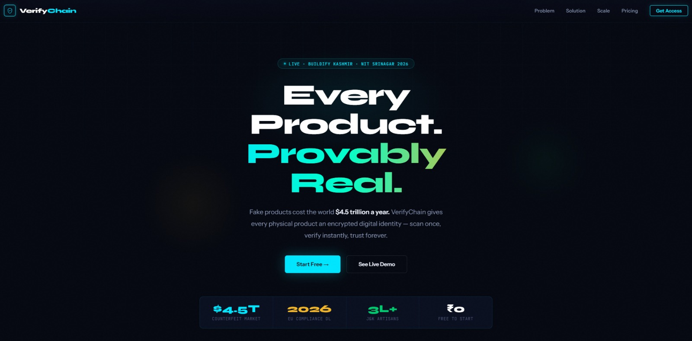
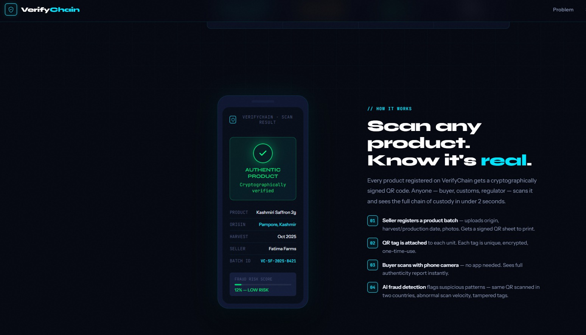
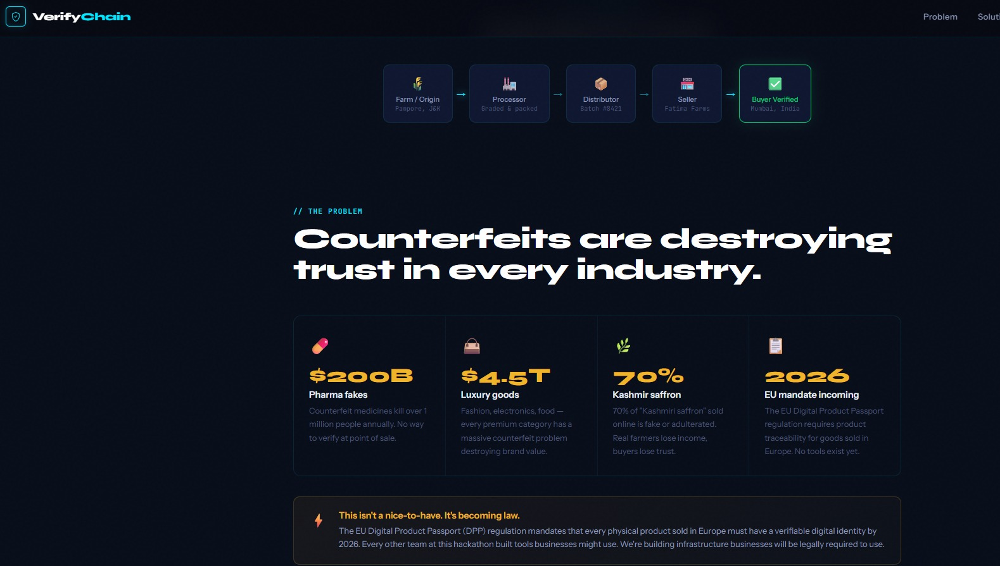
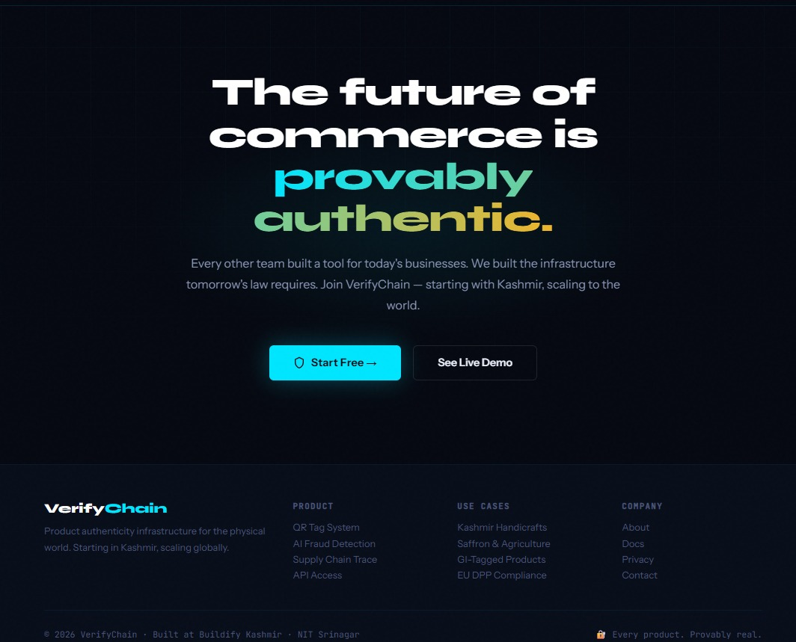
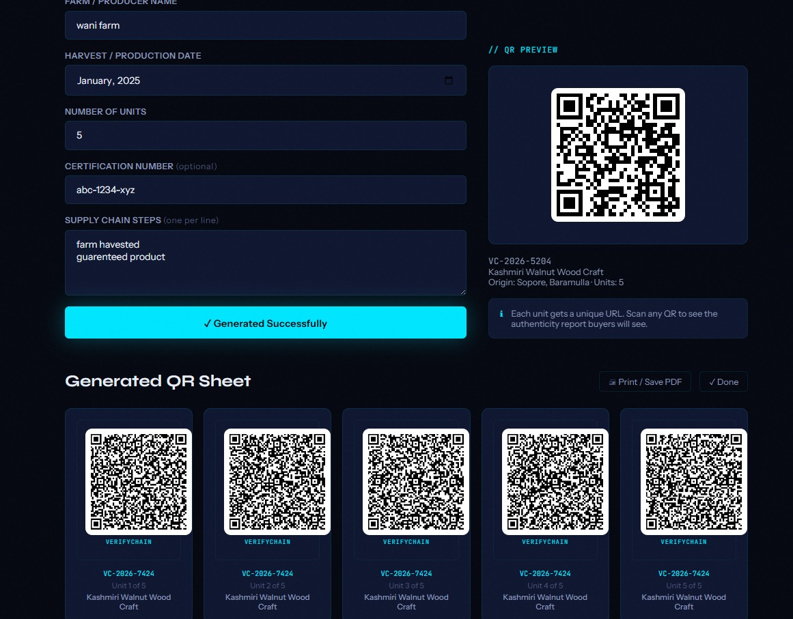
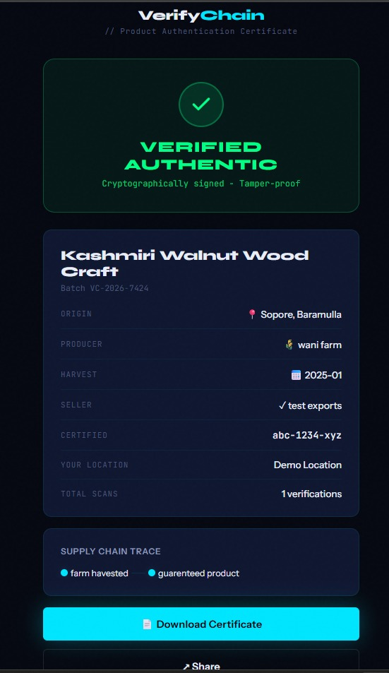
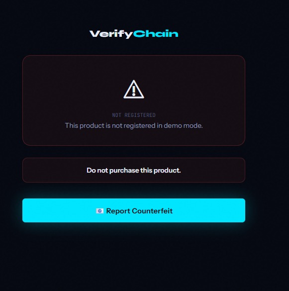
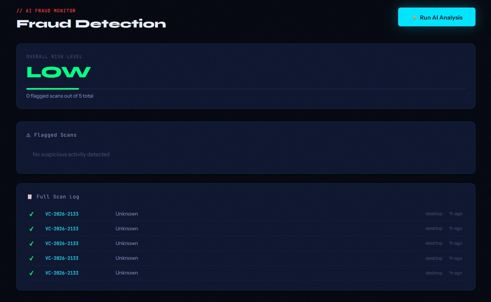

# VerifyChain

**Product authenticity infrastructure for the physical world** — HMAC-sealed QR tags, server-verified scans, and seller tooling for batch lifecycle, fraud monitoring, and EU DPP-ready exports.

[](package.json)
[]()
[]()

> Every product deserves a provable identity — scan once, verify instantly, trust forever.

**Production deploy guide:** [PRODUCTION.md](PRODUCTION.md)

---

## Product Showcase

| The Vision | How It Works |
|:---:|:---:|
|  |  |
| Every product. Provably real. | Scan any product. Know it's real. |

| The Problem | Buyer Verification |
|:---:|:---:|
|  |  |
| Counterfeits destroy trust globally. | Authenticity certificate on scan. |

| Seller Dashboard | Fraud Detection |
|:---:|:---:|
|  |  |
| Mint signed QR batches per unit. | Invalid signature / not registered. |

| Future Vision | Platform Overview |
|:---:|:---:|
|  |  |
| Commerce that is provably authentic. | Infrastructure for traceable supply chains. |

---

## The Problem

Fake goods cost the global economy an estimated **$4.5 trillion** annually. Premium producers — saffron, Pashmina, pharmaceuticals, artisan goods — cannot prove authenticity at the point of sale. Buyers cannot distinguish a real label from a photocopied QR.

The **EU Digital Product Passport (DPP)** will require verifiable product identity for goods sold in Europe from **2026** onward. VerifyChain is built as compliance-oriented infrastructure, not just a QR generator.

---

## What VerifyChain Does

Each physical unit gets a **unique, HMAC-SHA256–signed** QR code. Anyone can scan it with a phone camera (no app install). The server validates:

| Check | Description |
|--------|-------------|
| **Authenticity** | Signature matches batch secret |
| **Registry** | Token exists in `qr_tokens` |
| **Identity** | Unit number and `jti` match registry |
| **Policy** | One-time seal, limited scans, or unlimited |
| **Status** | Batch not recalled or suspended |

**Important:** QR payloads are **cryptographically signed, not encrypted**. Data inside the token can be decoded; security comes from **forgery resistance**, not secrecy.

---

## Core Features

### Cryptographic QR system
- Per-batch `hmac_secret` (32-byte, server-side only in production)
- Per-unit payload: `bid`, `uid`, `pid`, `jti`, `n`, `ts` + HMAC signature
- Base64url token embedded in `#/verify/{token}`
- Category-themed printable tag sheets with 8-character fingerprints

### Scan policies (seller-configurable)
| Policy | Behavior |
|--------|----------|
| **One-Time Seal** | First scan succeeds; further scans return `ALREADY_REDEEMED` |
| **Limited** | Configurable max scans per tag (e.g. 3) |
| **Unlimited** | Open verification (samples, education) |

### Seller platform
- **Dashboard** — batches, scan activity, fraud alert counts
- **Batch creator** — metadata, supply chain, policy picker, live QR preview
- **Batch command center** (`#/batch/{id}`) — recall, suspend, reactivate, unit registry, DPP export, QR reprint
- **Analytics** — 7-day trends, top locations, category mix, device breakdown
- **Fraud monitor** — flagged scans, risk meter, optional Gemini AI analysis
- **Settings** — profile, usage summary, bulk DPP export

### Buyer / public
- **Scan** — camera (jsQR) or manual token entry
- **Verify certificate** — trust score, unit fingerprint, scan policy, supply chain trace
- **Trust center** (`#/trust`) — how verification works (public)

### Compliance & export
- **EU DPP JSON** per batch or bulk export (product, supply chain, unit fingerprints, compliance block)

### Fraud detection
- DB triggers: geographic impossibility, high scan volume
- Client rule engine + optional **Gemini** enrichment via `/api/ai/fraud`
- Invalid signatures logged as critical counterfeit events

---

## App Routes

| Route | Access | Purpose |
|--------|--------|---------|
| `#/` | Public | Marketing landing |
| `#/login`, `#/register` | Public | Supabase seller auth |
| `#/seller` | Seller | Dashboard |
| `#/batch-new` | Seller | Register batch + mint QRs |
| `#/batch/{id}` | Seller | Batch management |
| `#/analytics` | Seller | Verification analytics |
| `#/fraud` | Seller | Fraud monitor + AI |
| `#/settings` | Seller | Account & exports |
| `#/scan` | Public | Camera / manual scan |
| `#/verify/{token}` | Public | Authenticity certificate |
| `#/trust` | Public | Trust center |

---

## Architecture

```text
[Seller Dashboard]  -->  [Express API]  -->  [/api/config, /api/ai/fraud]
        |                        |
        v                        v
[Supabase Auth/DB]  <--  [PostgreSQL: batches, qr_tokens, scans, fraud_alerts]
        |
        v
[verify-qr Edge Function (Deno)]  -- HMAC verify, registry, policies, scan log
        ^
        |
[Buyer Phone Scan]  -->  #/verify/{signed-token}
```

### Stack

| Layer | Technology |
|--------|------------|
| Frontend | HTML5, vanilla CSS (royal theme), modular ES6 (`assets/js/modules/`) |
| API server | Node.js 18+, Express, Helmet, compression |
| Database | Supabase PostgreSQL + RLS |
| Verification | Supabase Edge Function `verify-qr` (Deno, Web Crypto) |
| Realtime | Supabase channels (scans, fraud alerts) |
| AI (optional) | Google Gemini 1.5 Flash |
| QR rendering | qrcodejs, jsQR |
| Deploy | [render.yaml](render.yaml) blueprint |

### Verification modes

| Mode | When | Behavior |
|------|------|----------|
| **Production** | Supabase configured + `VC_DEMO_MODE=false` | Edge function verifies HMAC, registry, policies |
| **Offline training** | No backend or demo flag | Full local HMAC + registry in localStorage (UI demos only) |

Check `/api/config` for `productionReady: true` and a green in-app banner.

---

## Project Structure

```text
Verify-Chain/
├── index.html                 # Landing + app shell + global CSS
├── server.js                  # Express static, /api/config, /api/ai/fraud
├── assets/js/modules/         # VC.* application modules
│   ├── 01-config.js           # Runtime config from /api/config
│   ├── 02-crypto.js           # HMAC, token minting, themes
│   ├── 03-state.js            # localStorage state
│   ├── 04-db.js               # Supabase + verify orchestration
│   ├── 05-router.js           # Hash router
│   ├── 06-ui.js               # Shared UI components
│   ├── 07-views-auth.js
│   ├── 08-views-seller.js
│   ├── 09-views-batch.js
│   ├── 10-views-verify.js
│   ├── 11-views-scan.js
│   ├── 12-views-fraud.js
│   ├── 13-ai.js
│   ├── 15-views-analytics.js
│   ├── 16-views-batch-detail.js
│   ├── 17-views-trust.js
│   ├── 18-views-settings.js
│   └── 14-init.js
├── supabase/
│   ├── schema.sql             # Full schema (new projects)
│   ├── migrations/            # 002 policies, 003 atomic claim
│   └── functions/verify-qr/   # Production verification
├── tests/
│   ├── smoke.mjs
│   ├── crypto.test.mjs
│   └── e2e/app.spec.js
├── PRODUCTION.md              # Production deployment checklist
└── .env.example
```

---

## Quick Start

### Prerequisites
- **Node.js 18+**
- **Supabase** project (for production verification)
- **Gemini API key** (optional, fraud AI)

### 1. Install and configure

```bash
git clone <your-repo-url>
cd Verify-Chain
npm install
cp .env.example .env
```

Edit `.env`:

```env
PORT=4173
VC_SUPABASE_URL=https://YOUR_PROJECT.supabase.co
VC_SUPABASE_ANON_KEY=your_anon_key
VC_EDGE_FUNCTION_URL=https://YOUR_PROJECT.supabase.co/functions/v1/verify-qr
VC_DEMO_MODE=false
VC_GEMINI_API_KEY=          # optional
VC_APP_VERSION=1.0.0
```

### 2. Database (Supabase SQL editor)

**New project:** run [`supabase/schema.sql`](supabase/schema.sql)

**Existing project:** run migrations in order:
1. [`supabase/migrations/002_scan_policy_and_tokens.sql`](supabase/migrations/002_scan_policy_and_tokens.sql)
2. [`supabase/migrations/003_atomic_qr_claim.sql`](supabase/migrations/003_atomic_qr_claim.sql)

### 3. Edge function

Set secrets in Supabase → Edge Functions → `verify-qr`:
- `VC_SB_URL` = your Supabase URL
- `VC_SB_SERVICE_ROLE_KEY` = service role key (never in the browser)

```bash
supabase functions deploy verify-qr
```

### 4. Run

```bash
npm run dev
# or
npm start
```

Open [http://localhost:4173](http://localhost:4173) · Config check: [http://localhost:4173/api/config](http://localhost:4173/api/config)

### 5. Test

```bash
npm run test:smoke
node tests/crypto.test.mjs
npm run test:e2e    # requires Playwright
```

---

## Environment Variables

| Variable | Required | Description |
|----------|----------|-------------|
| `VC_SUPABASE_URL` | Production | Supabase project URL |
| `VC_SUPABASE_ANON_KEY` | Production | Anon/public key (browser-safe) |
| `VC_EDGE_FUNCTION_URL` | Production | Usually `{SUPABASE_URL}/functions/v1/verify-qr` |
| `VC_DEMO_MODE` | No | `false` for production verify (defaults `false` when Supabase is set) |
| `VC_GEMINI_API_KEY` | No | AI fraud analysis enrichment |
| `VC_APP_VERSION` | No | Shown in runtime config |
| `PORT` | No | Server port (default `4173`) |

Edge function secrets (`VC_SB_*`) are set in the Supabase dashboard, not `.env`.

---

## Cryptographic Flow (summary)

**Mint (seller)**

1. Generate batch ID + `hmac_secret`
2. For each unit: build payload with unique `jti` + `nonce`
3. `sig` = HMAC-SHA256(payload, secret)
4. Store row in `qr_tokens`; render QR URL

**Verify (buyer)**

1. POST token to `verify-qr`
2. Recompute HMAC with batch secret
3. Match `qr_tokens` row; enforce policy + batch status
4. Log scan; run fraud pattern checks
5. Return certificate JSON to UI

Full details: [PRODUCTION.md](PRODUCTION.md)

---

## Scripts

| Command | Description |
|---------|-------------|
| `npm start` | Start Express server |
| `npm run dev` | Same as start |
| `npm run test:smoke` | Module / shell smoke tests |
| `node tests/crypto.test.mjs` | HMAC sign/verify tests |
| `npm run test:e2e` | Playwright browser tests |
| `npm test` | Smoke + E2E |

---

## Security Notes (honest)

- **Strengths:** Server-side HMAC, per-unit registry, scan policies, recall/suspend, constant-time sig compare on edge, `hmac_secret` stripped from seller API responses.
- **Limits:** Symmetric HMAC (not public-key / blockchain); payload is readable if decoded; offline demo mode is not anti-counterfeit grade.
- **Do not** ship with `VC_DEMO_MODE=true` or without deployed `verify-qr` if you need real protection.
- **Mint new batches** after applying migrations — legacy tags may lack `jti` / registry rows.

---

## Deployment

- **Render:** use included [`render.yaml`](render.yaml); set env vars in the dashboard.
- **Supabase:** schema + migrations + edge function per [PRODUCTION.md](PRODUCTION.md).

---

## Vision

VerifyChain is authenticity and compliance infrastructure: businesses do not only sell products — they **prove** them.

---

*VerifyChain — Product Authenticity Infrastructure*
